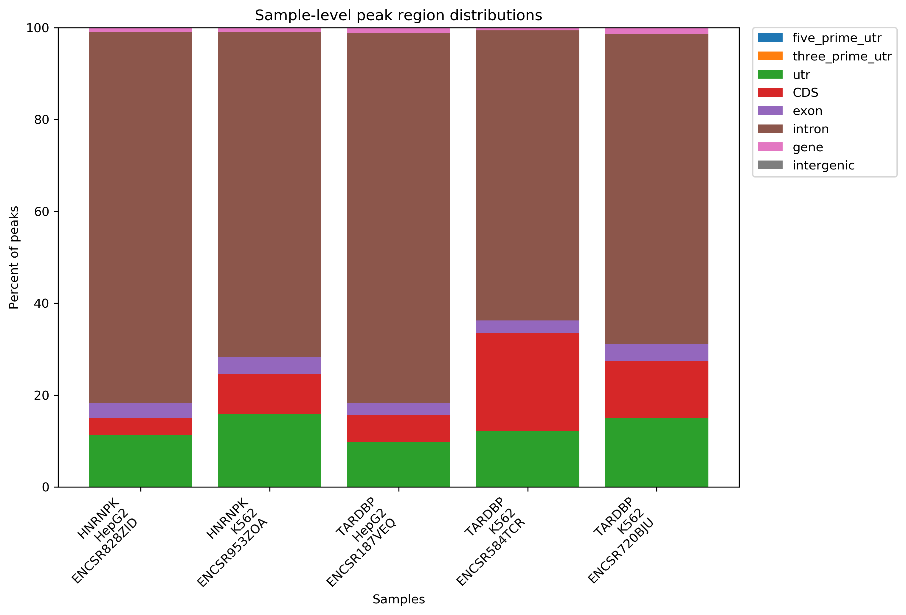
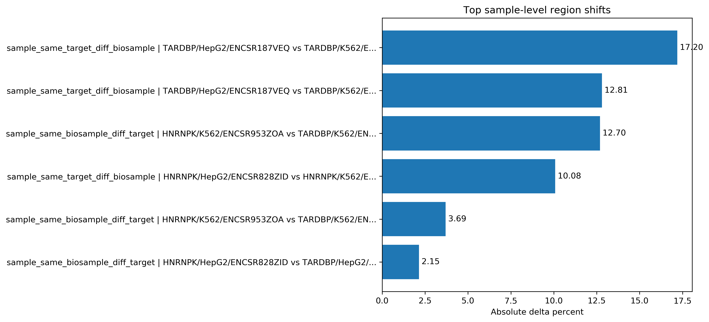
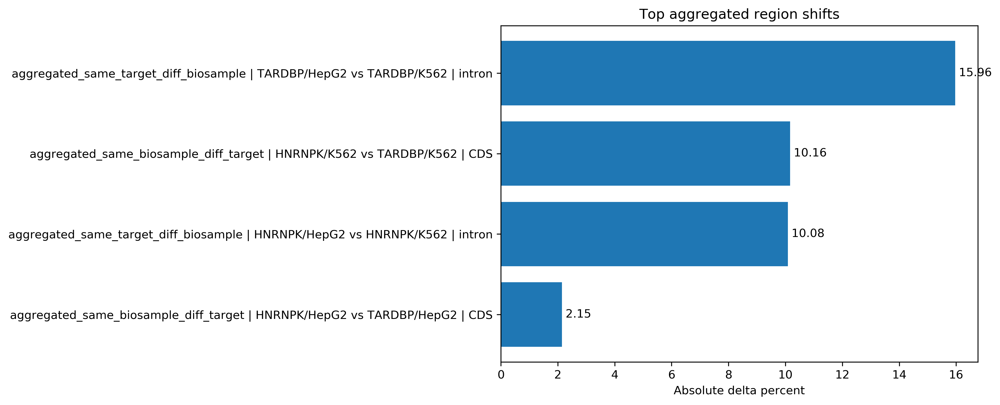

# Exploratory Findings Round 1

**Author**：wangshuo  
**Date**：2026-04-16  
**Project**：RNA Dynamics / RBP Binding Site Collection  

## 1. 文档目的

本文件用于总结当前项目第一轮分析（round 1）的结果。  
这一轮分析的目标不是得出具有普适性的最终结论，而是基于当前较小规模的数据集，识别稳定、清晰、值得后续验证的信号，并为下一阶段的扩展与深入分析提供方向。

---

## 2. 当前分析对象

本轮分析基于 ENCODE eCLIP 数据，围绕以下对象展开：

### 示例 RBP
- `HNRNPK`
- `TARDBP`

### 示例 biosample
- `HepG2`
- `K562`

### 当前选出的主 peak 文件
- `ENCSR828ZID | HNRNPK | HepG2 | ENCFF754XAQ`
- `ENCSR953ZOA | HNRNPK | K562 | ENCFF969JDI`
- `ENCSR187VEQ | TARDBP | HepG2 | ENCFF626XAA`
- `ENCSR584TCR | TARDBP | K562 | ENCFF606RXB`
- `ENCSR720BJU | TARDBP | K562 | ENCFF381KTD`

### 当前标准化后 peak 数量
- `HNRNPK | HepG2`：159594
- `HNRNPK | K562`：182444
- `TARDBP | HepG2`：160498
- `TARDBP | K562 | ENCSR584TCR`：107504
- `TARDBP | K562 | ENCSR720BJU`：42044

---

## 3. 当前流程已完成的关键步骤

截至目前，本项目已经完成以下分析链条：

```text
→ ENCODE metadata 收集
→ peak 文件筛选
→ 原始 peak 文件下载
→ 文件存在性与格式体检
→ 每个 experiment 选择主 peak 文件
→ 主 peak 文件标准化
→ peak 区域注释
→ 区域组成汇总
→ 区域组成比较
→ 绘图展示
```

当前项目已经从“数据整理阶段”进入“探索性结果解释阶段”。

---

## 4. 当前注释策略说明

当前的 peak 区域注释采用的是 **优先级注释（priority-based annotation）**。

也就是说，当一个 peak 同时与多个区域类别发生重叠时，不会同时归入多个类别，而是按照预先设定的优先级，仅分配一个“主区域身份”。

当前使用的优先级顺序为：

```text
→ five_prime_utr
→ three_prime_utr
→ utr
→ CDS
→ exon
→ intron
→ gene
→ intergenic
```

这意味着：

* 每个 peak 最终只被计入一个区域类别
* 区域组成统计不会重复计数
* 当前结果适合做整体区域组成比较

但也意味着：

* 当前结果并不保留一个 peak 同时重叠多个区域的全部信息
* 因此当前分析更适合做“总体偏好”判断，而不是更细粒度的边界型解释

---

## 5. 第一轮探索性结果：最核心的现象

本节中的核心结论来自区域注释汇总表和区域组成比较表。为了让这些结果更直观，下面加入当前已经绘制出的关键图形，用于辅助判断主要模式是否清晰、稳定。

### 图 1：不同样本的 peak 区域组成



*图 1 展示 5 个主 peak 文件在不同区域类别中的组成比例。该图最直接支持“当前所有样本均以 intron peaks 为主”这一观察。*

### 现象 1：所有样本都以 intron peaks 为主

当前所有 5 个样本在区域组成上都表现出一致的总体特征：

> **intron 是最主要的 peak 区域类别**

对应结果如下：

* `HNRNPK | HepG2`：intron 占比约 `80.88%`
* `HNRNPK | K562`：intron 占比约 `70.80%`
* `TARDBP | HepG2`：intron 占比约 `80.36%`
* `TARDBP | K562 | ENCSR584TCR`：intron 占比约 `63.17%`
* `TARDBP | K562 | ENCSR720BJU`：intron 占比约 `67.56%`

这说明，在当前示例数据中：

* 绝大多数 peaks 落在基因相关区域
* 而且主要集中在 intron 区域
* 这一结果与许多 RBP 参与前体 RNA 加工、剪接调控的常识是相符的

---

### 现象 2：几乎所有 peaks 都是非 intergenic 的

所有样本的 `non_intergenic_percent` 均接近 100%，约为 `99.9%` 左右。

这表明：

1. peak 文件与 GTF 注释的坐标体系匹配良好
2. 当前注释流程本身没有明显跑偏
3. 当前 peaks 绝大多数都能映射到基因相关区域，而不是随机背景或无法解释的区域

这是对整个 pipeline 正确性的一个重要支持信号。

---

### 现象 3：TARDBP 在 HepG2 与 K562 之间的区域偏好变化最明显

在同一 RBP 不同样本的比较中，当前最强信号来自：

* `TARDBP | HepG2`
* `TARDBP | K562`

区域比较结果显示：

* 最大变化区域：`intron`
* 最大差异幅度：约 `17.20%`（sample-level）
* 聚合后差异幅度仍约为 `15.96%`

这说明：

> 当前数据提示 TARDBP 的区域偏好较受细胞背景影响，尤其体现在 intron 区域的结合比例变化上。

这是当前最值得继续深挖的一条线索。

---

### 现象 4：K562 中 HNRNPK 与 TARDBP 的 CDS 偏好差异最明显

在同一 biosample 中不同 RBP 的比较里，当前最强信号来自：

* `HNRNPK | K562`
* `TARDBP | K562`

比较结果显示：

* 最大变化区域：`CDS`
* 差异幅度：约 `12.70%`（sample-level）
* 聚合后差异幅度仍约为 `10.16%`

这表明：

> 在 K562 这一细胞背景中，HNRNPK 与 TARDBP 的区域组成差异比在 HepG2 中更明显，且差异主要体现在 CDS 区域。

这可能提示不同 RBP 在特定细胞背景中具有不同的转录本区域偏好。

---

### 现象 5：HepG2 中 HNRNPK 与 TARDBP 的整体差异较小

相比 K562：

* `HNRNPK | HepG2`
* `TARDBP | HepG2`

之间的最大差异幅度仅约 `2.15%`，明显弱于 K562 中的同类比较。

这提示：

> HepG2 中 HNRNPK 与 TARDBP 的整体区域组成更接近，而 K562 更容易拉开两者的差异。

---

### 图 2：sample-level 区域组成变化最强的比较



*图 2 展示 sample-level pairwise comparison 中区域组成变化最明显的比较。该图支持两个 round 1 重点信号：`TARDBP | HepG2 vs K562` 的 intron 差异，以及 `HNRNPK vs TARDBP in K562` 的 CDS 差异。*

### 图 3：聚合层面的区域组成变化



*图 3 展示按 target 与 biosample 聚合后的 top region shifts。该图用于辅助判断 sample-level 观察是否仍能在聚合层面得到支持。*

## 6. 当前最值得关注的优先比较对象

基于现有区域组成与比较结果，建议当前优先深挖以下两组比较。

### Priority 1：`TARDBP: HepG2 vs K562`

理由：

* 当前同一 RBP 跨样本差异最大
* 差异主要集中于 intron 区域
* 生物学解释路径较清晰
* 适合作为“细胞背景影响 RBP 区域偏好”的候选案例

### Priority 2：`HNRNPK vs TARDBP in K562`

理由：

* 当前同一细胞背景内不同 RBP 差异最大
* 主要差异集中于 CDS 区域
* 适合作为“不同 RBP 在同一背景中的区域偏好差异”的候选案例

---

## 7. 当前结果的科学意义

当前结果尚不足以支持普适性的结论，但已经具备如下意义：

### 7.1 流程验证意义

当前所有结果表明，项目的峰文件筛选、标准化、注释与比较流程是可以产出合理生物学模式的。

### 7.2 模式发现意义

当前数据中已经出现两类清晰信号：

* 同一 RBP 在不同 biosample 中的区域偏好变化
* 不同 RBP 在同一 biosample 中的区域偏好差异

### 7.3 假设生成意义

当前结果已经足以支持形成若干探索性假设，例如：

* TARDBP 的结合区域组成可能比 HNRNPK 更受细胞背景影响
* K562 背景中不同 RBP 的 CDS 偏好差异可能更明显
* RBP 的区域分布模式可能具有细胞类型依赖性

---

## 8. 当前结果的局限性

### 8.1 数据量较小

当前分析仅基于：

* 2 个 RBP
* 2 个 biosample
* 5 个主 experiment

因此结果应视为“小规模探索”，而不能视为大规模规律。

### 8.2 仍存在偶然性风险

当前观察到的差异可能部分受到以下因素影响：

* experiment 个体差异
* 样本批次效应
* 主 peak 文件选择策略
* 当前只保留一个主文件的简化设计

### 8.3 区域注释为优先级注释

当前分类更适合描述整体区域组成，而不是保留 peak 的多重注释关系。

### 8.4 目前仍停留在区域层

当前结果回答的是：

* peaks 更偏向哪些区域

但尚未进入：

* 哪些具体 peak 导致差异
* 哪些基因受到影响
* 这些基因是否指向一致的功能模块

---

## 9. 当前阶段的正确结论表述方式

当前最合适的表述不是：

> “证明了 TARDBP 在所有细胞中都表现出更强的样本依赖性”

而应该是：

> “在当前 ENCODE 示例数据中，TARDBP 在 HepG2 与 K562 之间表现出较明显的区域偏好变化，而 HNRNPK 与 TARDBP 在 K562 中也显示出显著的 CDS 区域组成差异。这些现象构成了后续扩展与验证的候选信号。”

---

## 10. 下一步计划

围绕 priority comparisons 继续深入：

### 方向 A：提取差异 peak 集

优先提取：

* `TARDBP: HepG2 vs K562` 的 intron-specific / shared peaks
* `HNRNPK vs TARDBP in K562` 的 CDS-specific / shared peaks

### 方向 B：映射到基因层

从这些差异 peak 集中提取：

* overlap gene IDs
* overlap gene names
* top genes

### 方向 C：做轻量功能解释

评估候选基因是否富集于：

* RNA processing
* splicing
* mRNA regulation
* translation-related pathways

---

## 11. 当前 round 1 的总结

当前 round 1 探索性分析已经清楚地表明：

1. 当前所有样本的 peaks 以 intron 区域为主
2. 几乎所有 peaks 都位于可解释的基因相关区域
3. TARDBP 在 HepG2 与 K562 间的区域偏好变化最大
4. K562 中 HNRNPK 与 TARDBP 的 CDS 偏好差异最明显
5. 当前结果已经足以支持形成下一阶段的候选假设与深挖路线

因此，当前 round 1 的结论可以概括为：

> 当前小规模 ENCODE eCLIP 示例数据已经显示出具有解释潜力的 RBP 区域偏好差异信号，其中 TARDBP 的跨样本变化与 K562 中 HNRNPK/TARDBP 的 CDS 差异最值得进一步深挖；这些结果应被视为探索性发现，并作为下一阶段 peak-level 与 gene-level 分析的起点。

---
